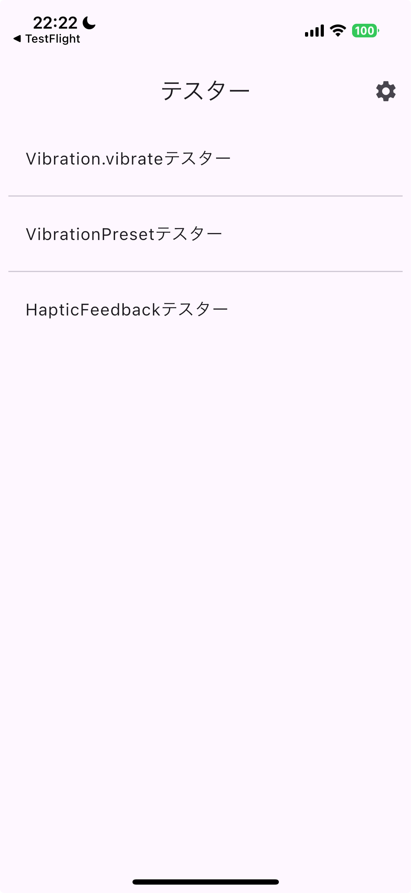
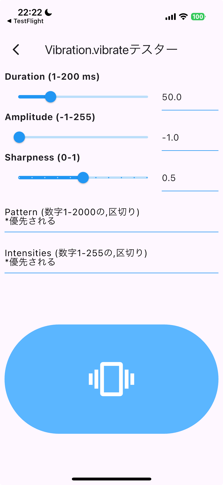
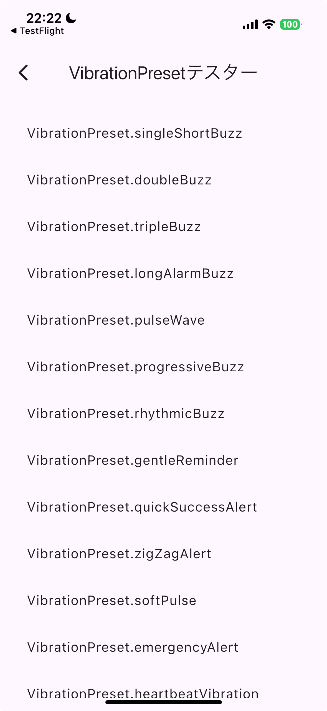

# Vibrate Tester

[](https://opensource.org/licenses/MIT)
[](https://flutter.dev)

A Flutter application for testing vibration functionality. This project allows you to compare and verify Flutter's standard vibration features with third-party vibration library capabilities.

**🎉 This project is free to use!** Feel free to fork, modify, distribute, or use it in any way you like.

## Features

### Vibration Libraries Tested

1. **vibration library** - Third-party vibration control library
   - Custom pattern vibrations
   - Vibration intensity control
   - Detailed vibration settings

2. **HapticFeedback (Standard Library)** - Flutter's default haptic feedback
   - Light impact (lightImpact)
   - Medium impact (mediumImpact)
   - Heavy impact (heavyImpact)
   - Selection feedback (selectionClick)

### Test Functions

- **Vibration.vibrate Tester**: Test basic vibration functionality
- **VibrationPreset Tester**: Test preset vibration patterns
- **HapticFeedback Tester**: Test standard haptic feedback

## Screenshots
| Main Menu | Vibration Settings | HapticFeedback Interface |
|-----------|-------------------|--------------------------|
|  |  |  |
| *Main menu showing all available vibration testers* | *Vibration.vibrate tester with customizable settings* | *HapticFeedback tester interface* |

## Installation and Running

1. Clone the project:
   ```bash
   git clone https://github.com/yourusername/vibrate_tester.git
   cd vibrate_tester
   ```

2. Install dependencies:
   ```bash
   flutter pub get
   ```

3. Run the app:
   ```bash
   flutter run
   ```

## Supported Platforms

- Android
- iOS
- Web (vibration functionality may be limited due to browser restrictions)

## Used Libraries

- [vibration](https://pub.dev/packages/vibration) ^3.1.3 - For custom vibration control
- Flutter's standard HapticFeedback - For basic haptic feedback

## Getting Started

This project is a starting point for a Flutter application that tests vibration functionality.

For help getting started with Flutter development, view the
[online documentation](https://docs.flutter.dev), which offers tutorials,
samples, guidance on mobile development, and a full API reference.

## iOS Build Error Solutions

If you encounter the `ld: framework 'Pods_Runner' not found` error, follow these steps:

1. Run the following commands in the project directory:
   ```bash
   cd ios
   pod deintegrate
   pod install
   ```

2. If that doesn't resolve the issue, try this:
   ```bash
   flutter clean
   cd ios
   pod deintegrate
   rm -rf Pods Podfile.lock
   pod install
   cd ..
   flutter run
   ```

## Assets

The `assets` directory houses images, fonts, and any other files you want to
include with your application.

The `assets/images` directory contains [resolution-aware
images](https://flutter.dev/to/resolution-aware-images).

## Localization

This project generates localized messages based on arb files found in
the `lib/src/localization` directory.

To support additional languages, please visit the tutorial on
[Internationalizing Flutter apps](https://flutter.dev/to/internationalization).

## Author

**Firon** - [GitHub](https://github.com/firon)

## License

This project is published under the MIT License. Feel free to use it.

For details, see the [LICENSE](LICENSE) file.

## Contributing

Pull requests and issue reports are welcome. We appreciate your cooperation in making this project better.

## Disclaimer

This application was created for educational and verification purposes. Vibration functionality may vary depending on the device and OS.
